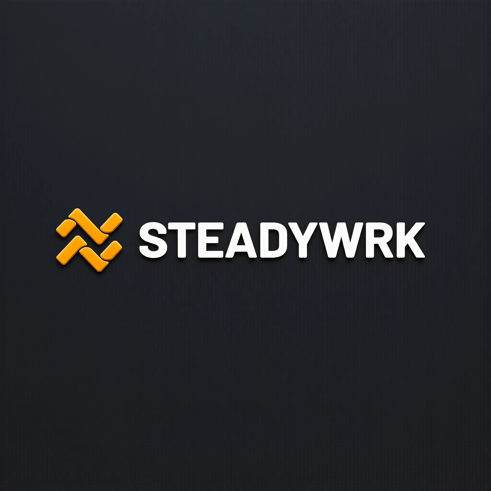

<div align="center">

<picture>
  <source media="(prefers-color-scheme: dark)" srcset="apps/web/public/brand/logo-dark.webp" width="400">
  
</picture>

### Where ambition compounds.

AI-native career-launch platform for Jordan's most ambitious talent.

**Next.js 16 · React 19 · Tailwind v4 · Drizzle ORM · Neon · Vercel**

[](https://steadywrk.app)
[]()

</div>

---

## What is STEADYWRK?

STEADYWRK is an AI-native career platform that connects ambitious Jordanian talent with US commercial operations. We train, deploy, and develop operators who serve US clients across facility management, digital marketing, AI development, and business process operations.

**Headquartered:** Building 15, King Hussein Business Park, Amman, Jordan

**Entity:** STEADYWRK LLC (US/JO)

## Architecture

Single Next.js 16 application serving four role-based experiences from one codebase:

| Layer | Experience | Auth | Routes |
|---|---|---|---|
| **Public** | Brand, careers, programs, culture | None | `/`, `/careers`, `/programs`, `/about`, `/culture` |
| **Applicant** | 5-step application, status tracker | Email-only | `/apply/[role]` |
| **Employee** | Dashboard, training, tools, leaderboard | Clerk RBAC | `/dashboard/*` |
| **HR Admin** | Pipeline, team management, analytics | Clerk RBAC (admin) | `/dashboard/*` |

Routed silently via Clerk `publicMetadata` middleware. One Neon Postgres database. One Vercel deployment.

## Tech Stack

| Layer | Technology |
|---|---|
| Framework | Next.js 16 (App Router, React 19) |
| Styling | Tailwind CSS v4, Framer Motion 12 |
| Typography | Cabinet Grotesk (display) + Satoshi (body) via Fontshare |
| Auth | Clerk (RBAC, passwordless, OAuth) |
| Database | Neon (Serverless Postgres) |
| ORM | Drizzle ORM with drizzle-zod |
| Email | Resend + React Email |
| Analytics | PostHog (funnels, drop-off) |
| Scheduling | Cal.com (WhatsApp workflows) |
| Deploy | Vercel (web), Cloudflare Workers (MCPs) |

## Getting Started

```bash
git clone https://github.com/karimalsalah/steadywrk.git
cd steadywrk
npm install
cp apps/web/.env.example apps/web/.env.local
npm run dev
```

## Design System

Built on Brand Guidelines v2.0:

| Token | Value | Role |
|---|---|---|
| `--color-brand` | `#E58A0F` | CTAs, brand moments, dopamine color |
| `--color-bg` | `#FAFAF8` | Page background (warm off-white) |
| `--color-text` | `#23211D` | Primary text (Graphite) |
| `--font-display` | Cabinet Grotesk | Headlines, display type |
| `--font-body` | Satoshi | Body copy, UI text |
| `--radius-md` | 8px | Buttons, cards, inputs |

**Rules:** Max 3 amber elements per viewport. 90% neutral. Orange is the reward. Never Poppins/Montserrat/Roboto.

## GEO (Generative Engine Optimization)

- [`/llms.txt`](apps/web/public/llms.txt) — Company summary for LLM extraction
- [`/llms-full.txt`](apps/web/public/llms-full.txt) — Full flattened content
- `schema.org/Organization` — JSON-LD with KHBP address
- `schema.org/JobPosting` — Structured data for all open roles
- Sitemap, robots.txt, OpenGraph images configured

## Project Structure

```
steadywrk/
├── CLAUDE.md                        # AI agent instructions
├── README.md                        # This file
├── biome.json                       # Linting + formatting
├── turbo.json                       # Monorepo config
├── apps/web/
│   ├── src/app/
│   │   ├── page.tsx                 # Homepage (cinematic hero)
│   │   ├── layout.tsx               # Root layout (fonts, metadata)
│   │   ├── globals.css              # Tailwind v4 @theme tokens
│   │   ├── careers/                 # Filterable job listing
│   │   │   └── [slug]/             # Individual job pages (JobPosting schema)
│   │   ├── programs/                # IGNITE, ORBIT, APEX overview
│   │   │   └── [slug]/             # Individual program pages
│   │   ├── apply/
│   │   │   └── [role]/             # 5-step multi-step application form
│   │   ├── about/                   # Company story, mission
│   │   ├── culture/                 # Values, onboarding quest line
│   │   ├── api/                     # API routes (apply, contact, health)
│   │   ├── dashboard/              # Employee + admin (behind Clerk)
│   │   ├── sitemap.ts              # Auto-generated sitemap
│   │   └── robots.ts               # SEO crawl directives
│   ├── src/components/
│   │   ├── layout/                  # Navbar, Footer
│   │   └── ui/                      # 25 components (MagicUI + custom)
│   ├── src/lib/
│   │   ├── data.ts                  # Roles, programs, services, tech
│   │   ├── schemas.ts               # Zod validation schemas
│   │   └── utils.ts                 # cn() and helpers
│   ├── src/fonts/                   # Cabinet Grotesk + Satoshi .woff2
│   └── public/
│       ├── brand/                   # WebP brand images
│       ├── llms.txt                 # GEO for AI models
│       ├── llms-full.txt            # Extended GEO
│       └── manifest.webmanifest     # PWA manifest
└── packages/db/
    ├── src/
    │   ├── schema.ts                # Drizzle ORM tables (6)
    │   ├── types.ts                 # Insert/select schemas (drizzle-zod)
    │   └── index.ts                 # Neon driver + exports
    └── drizzle.config.ts            # Migration config
```

## Database Schema

Six tables in `packages/db/`:

| Table | Purpose |
|---|---|
| `applicants` | Full application data, status pipeline, scores |
| `job_listings` | Positions with department, salary, requirements |
| `blog_posts` | Content with SEO fields, publish workflow |
| `employees` | Clerk-linked, gamification (badges, points, streaks) |
| `interview_slots` | Cal.com scheduling integration |
| `email_events` | ADVANCE/REJECT pipeline event tracking |

---

<div align="center">

&copy; 2026 STEADYWRK LLC &middot; Building 15, KHBP, Amman, Jordan &middot; [steadywrk.app](https://steadywrk.app)

</div>
